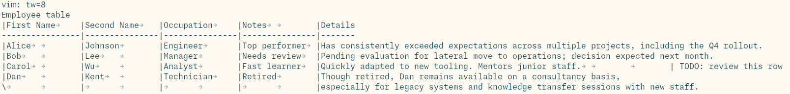

TPSV
====

TPSV stands for Tab-Pipe-Separated-Values. It is a human-readable alternative to CSV and TSV.
Like both of these formats, TPSV is able to describe tabular data where each cell contains a string value.
The primary design goal of TPSV is ease of parsing and ease of use such that anyone with a text editor can work with it, no plugins required.

## Syntax

The basic syntax is simple.

1. A cell starts with `|` and ends with one or more tabs.
2. A line that starts with a cell is a row. Any other lines are ignored.
3. The first row defines the number of columns.

That's all you need, but there are a few more rules to make life easier.

4. A row with too few cells has the remaining cells be an empty string.
5. A row with too many cells has the superfluous cells ignored.
6. The last column in a row does not need to end with tabs.

Then there is one last optional rule, the multiline extension.

7. A row that starts with `\` instead of `|` is treated as a continuation row.
   The non-empty contents of its cells are appended to the cells of the previous row, delimited by a newline character.

## Example

This is a sample TPSV demonstrating the format.
The gray arrows are tab characters.



This example highlights a few aspects.

- The first two lines are comments. The first line is a modeline, which can be interpreted by text editors that support them, and in this case sets the tab width to 4.
- The first row is usually a header, giving captions to the columns.
- The header separator does not start with `|` or `\`, so it is ignored.
- This choice of header separator makes the example compatible with Markdown pipe tables, which are recognized as tables in many contexts, including GitHub-flavored Markdown.
  Convenient if you want to paste it somewhere.
- The last column is ideal for long cell contents.
- The cell with the "TODO" is beyond the last column, so it acts as a comment.
- The last line is a continuation, which can be nice if you don't want the text to exceed a certain width.

## Editor compatibility

Recommendations:

- Use a monospaced text editor.
- Configure your editor to render tab characters (so you can distinguish them from spaces).
- Use editorconfig to set tabwidth for specific files, or use modelines like `vim: tw=8`, which are supported by several editors.
- A smaller tab-width gives you finer control over column widths, but requires more manual width management.
  I would generally recommend a tab-width of 8 for TPSV files, but other choices can make a lot of sense too.

Example .editorconfig for generic tpsv files:

```
[*.tpsv]
indent_style = tab
tab_width = 8
max_line_length = 999
insert_final_newline = true
```

## Comparison with other formats

Improvements over TSV:

- Supports comments
- Easier to view in text editors without setting the tabwidth very high
  (which would make all columns as wide as the widest column)
- Can be made compatible with Markdown pipe tables
- Multiline extension

Improvements over Markdown pipe tables:

- Less need to manage spaces for vertical alignment. Tabs are easier to space evenly (unless you use a tab width of 1).
- Cell contents are able to contain pipes and leading/trailing spaces.
- Multiline extension

## Parsing

This parses the basic syntax into an iterator of python lists.

```python
def parse_tpsv(file):
    row_len = -1
    for line in file:
        if line.startswith('|'):
            cells = [c.rstrip('\t') for c in line[1:].rstrip('\n').split('\t|')]
            row_len = len(cells) if row_len < 0 else row_len # Decide number of columns
            yield cells[:row_len] + [''] * (row_len - len(cells)) # Normalize row size
```

To also parse the multiline extension, something like this would do

```python
def parse_tpsv_multiline(file):
    row_len, row = -1, None
    for line in file:
        if line.startswith('|'):
            if row:
                yield row
            cells = [c.rstrip('\t') for c in line[1:].rstrip('\n').split('\t|')]
            row_len = len(cells) if row_len < 0 else row_len
            row = cells[:row_len] + [''] * (row_len - len(cells))
        elif line.startswith('\\') and row:
            cells = [c.rstrip('\t') for c in line[1:].rstrip('\n').split('\t|')]
            for i, c in enumerate(cells[:row_len]):
                row[i] += '\n' + c if c else '' # Continue cell content if needed
    if row:
        yield row
```

